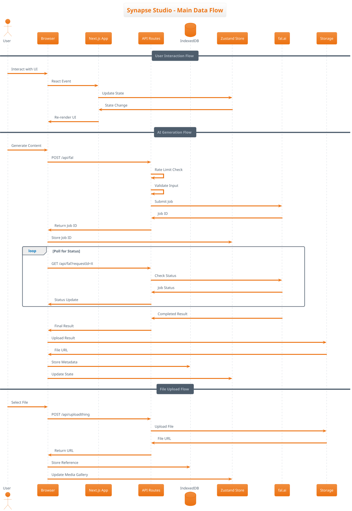
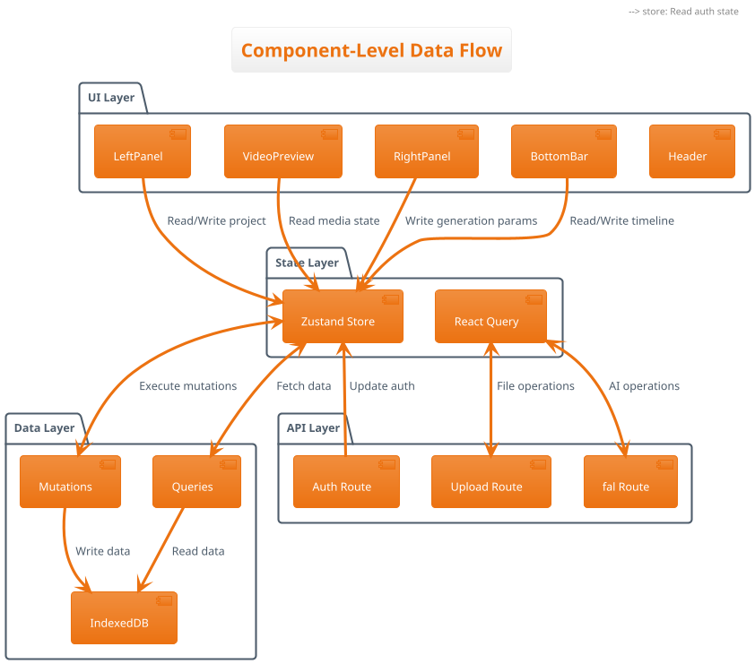
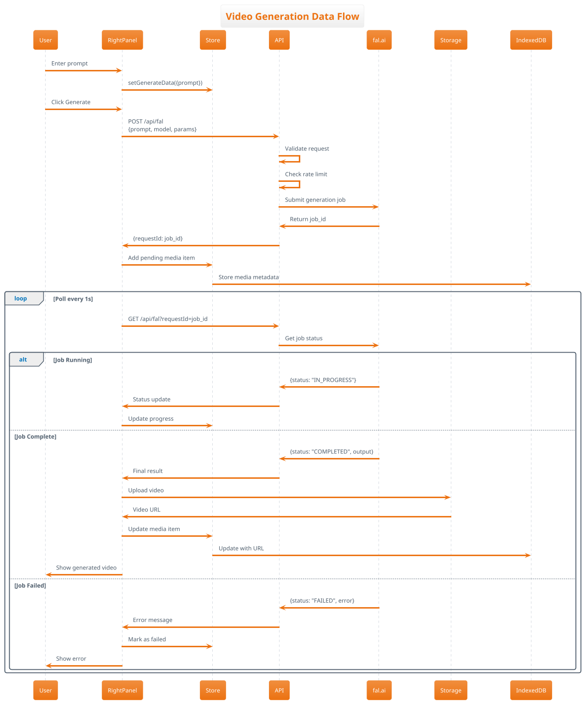
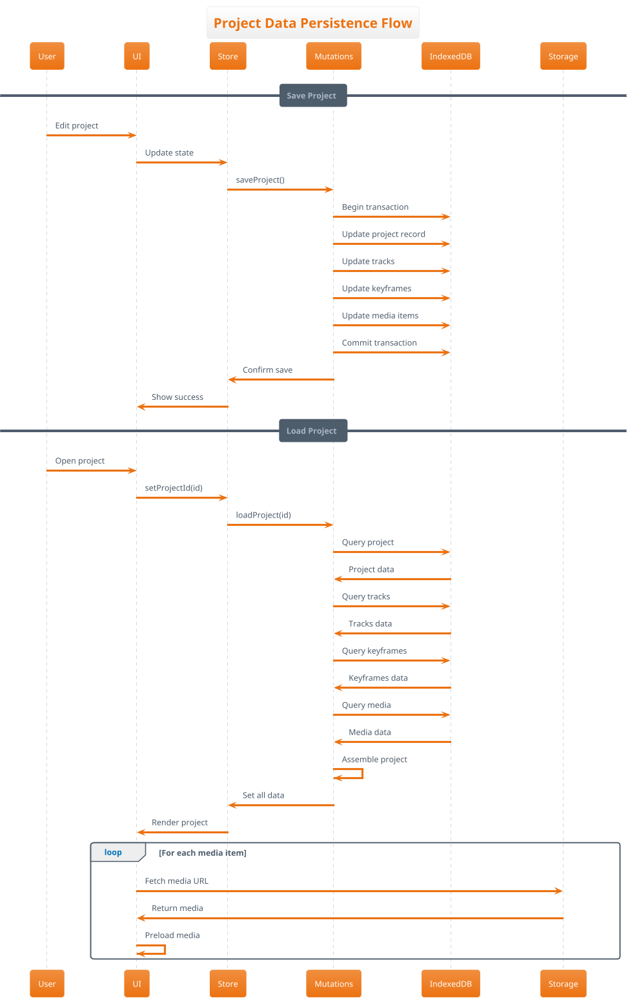
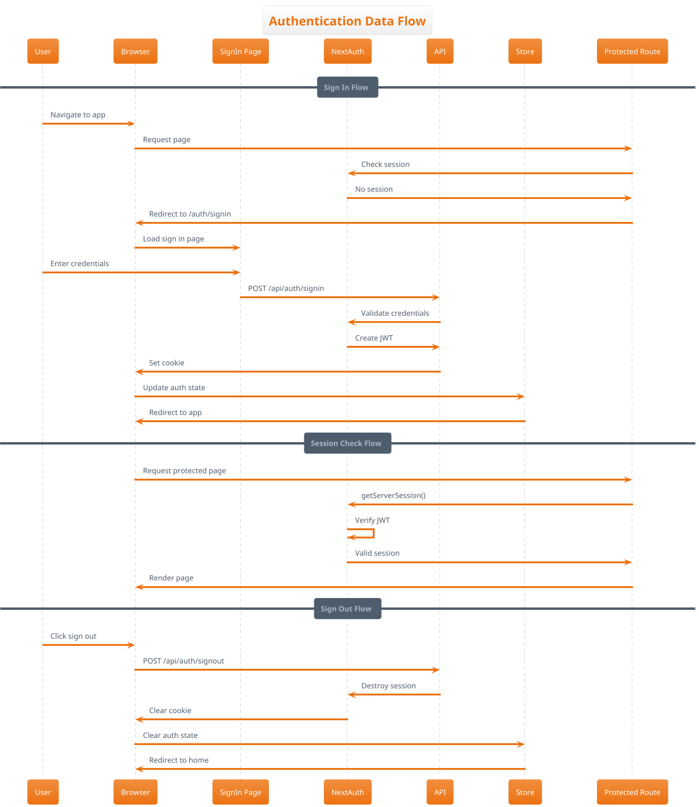
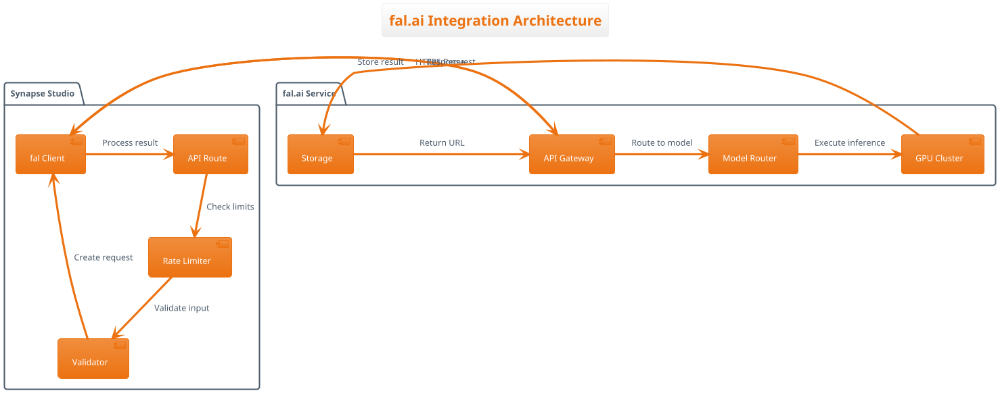
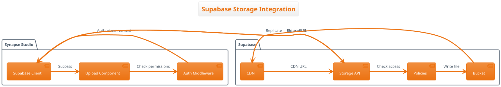
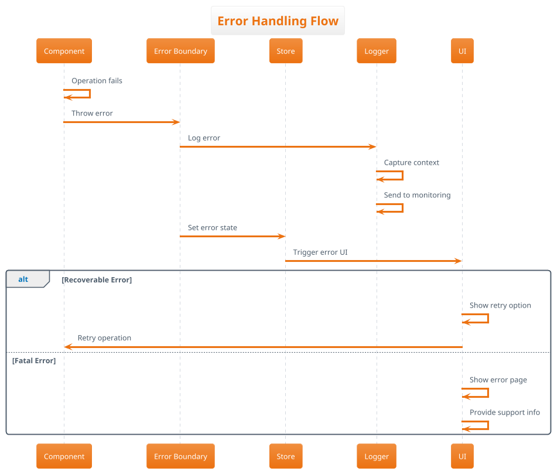

# Data Flow & Integration Architecture

## Overview

This document describes how data flows through Synapse Studio, including request/response patterns, event flows, data transformations, and integration points with external services.

## Primary Data Flow Diagram



## Component Interaction Flow



## Detailed Data Flow Scenarios

### 1. Video Generation Flow



### 2. Project Save/Load Flow



### 3. Authentication Flow



## Data Transformation Pipeline

### 1. Input Processing

```typescript
// Input validation and transformation
interface InputPipeline {
  // 1. Raw user input
  rawInput: any;
  
  // 2. Validation
  validated: z.infer<typeof inputSchema>;
  
  // 3. Sanitization
  sanitized: {
    prompt: string; // XSS cleaned
    params: Record<string, any>; // Type coerced
  };
  
  // 4. Normalization
  normalized: {
    endpointId: string;
    input: ModelSpecificInput;
  };
}
```

### 2. API Response Transformation

```typescript
// API response processing pipeline
interface ResponsePipeline {
  // 1. Raw API response
  raw: unknown;
  
  // 2. Type validation
  validated: z.infer<typeof responseSchema>;
  
  // 3. Data mapping
  mapped: {
    id: string;
    status: Status;
    output?: MediaOutput;
    error?: ErrorDetail;
  };
  
  // 4. UI-ready data
  formatted: MediaItem;
}
```

### 3. Storage Format Transformation

```typescript
// Storage format transformations
interface StorageTransform {
  // IndexedDB format
  indexedDB: {
    id: string;
    projectId: string;
    data: Uint8Array; // Compressed
    metadata: object;
    timestamp: number;
  };
  
  // Cloud storage format
  cloud: {
    url: string;
    contentType: string;
    size: number;
    metadata: Record<string, string>;
  };
  
  // Runtime format
  runtime: {
    id: string;
    url: string;
    blob?: Blob;
    cached: boolean;
  };
}
```

## Integration Points

### 1. fal.ai Integration



### 2. Supabase Integration



## Event Flow Patterns

### 1. User Interaction Events

```typescript
// Event flow from UI to state
interface EventFlow {
  // User action
  userEvent: MouseEvent | KeyboardEvent;
  
  // React handler
  componentHandler: (e: Event) => void;
  
  // State action
  storeAction: (payload: any) => void;
  
  // Side effects
  effects: {
    api?: Promise<Response>;
    storage?: Promise<void>;
    analytics?: void;
  };
  
  // UI update
  rerender: () => void;
}
```

### 2. Real-time Updates

```typescript
// Polling-based real-time updates
interface RealtimeFlow {
  // Initial request
  startPolling: (jobId: string) => void;
  
  // Polling interval
  interval: NodeJS.Timer;
  
  // Status check
  checkStatus: () => Promise<JobStatus>;
  
  // Update handler
  onUpdate: (status: JobStatus) => void;
  
  // Completion
  onComplete: (result: any) => void;
  
  // Cleanup
  stopPolling: () => void;
}
```

## Data Consistency Patterns

### 1. Optimistic Updates

```typescript
// Optimistic update pattern
async function optimisticUpdate(action: Action) {
  // 1. Update UI immediately
  store.update(action.optimisticData);
  
  try {
    // 2. Perform actual operation
    const result = await api.execute(action);
    
    // 3. Reconcile with server response
    store.reconcile(result);
  } catch (error) {
    // 4. Rollback on failure
    store.rollback(action);
    throw error;
  }
}
```

### 2. Cache Invalidation

```typescript
// Cache invalidation strategy
interface CacheStrategy {
  // Time-based invalidation
  ttl: number; // seconds
  
  // Event-based invalidation
  invalidateOn: string[]; // event names
  
  // Manual invalidation
  invalidate: () => void;
  
  // Validation
  isStale: () => boolean;
}
```

## Error Handling Flow



## Performance Considerations

### 1. Data Loading Strategies

- **Lazy Loading**: Load data only when needed
- **Prefetching**: Anticipate user actions
- **Pagination**: Load data in chunks
- **Virtual Scrolling**: Render only visible items

### 2. Caching Layers

```typescript
// Multi-layer caching
interface CacheLayers {
  // L1: Component state
  component: Map<string, any>;
  
  // L2: Zustand store
  store: StateCache;
  
  // L3: React Query
  query: QueryCache;
  
  // L4: IndexedDB
  local: IDBCache;
  
  // L5: CDN
  cdn: URLCache;
}
```

### 3. Bundle Optimization

- **Code Splitting**: Dynamic imports for large components
- **Tree Shaking**: Remove unused code
- **Minification**: Compress JavaScript
- **Compression**: Gzip/Brotli for network transfer

## Monitoring & Observability

### 1. Data Flow Metrics

```typescript
// Key metrics to monitor
interface DataFlowMetrics {
  // Latency metrics
  apiLatency: number; // ms
  dbLatency: number; // ms
  renderLatency: number; // ms
  
  // Throughput metrics
  requestsPerSecond: number;
  dataTransferRate: number; // MB/s
  
  // Error metrics
  errorRate: number; // percentage
  failedRequests: number;
  
  // Resource metrics
  cacheHitRate: number; // percentage
  memoryUsage: number; // MB
}
```

### 2. Tracing Strategy

- Request ID propagation through all layers
- Timing information at each step
- Error context capture
- User session correlation