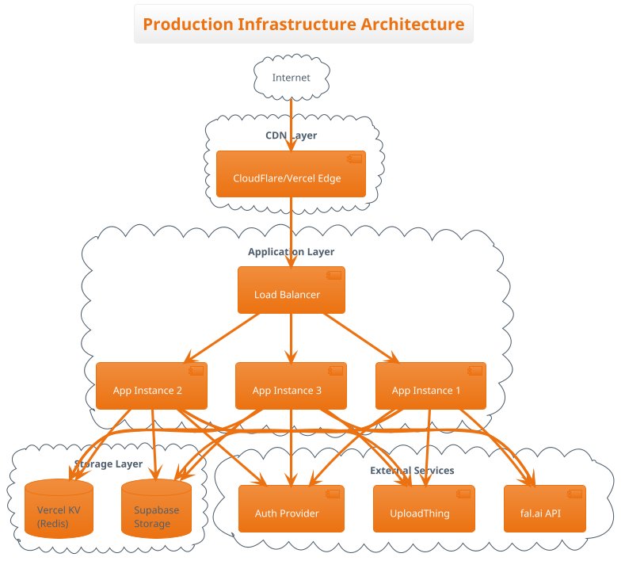
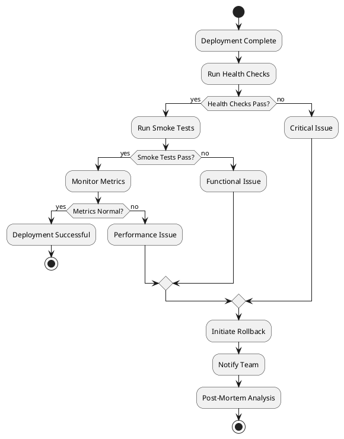

# Deployment Guide

## Overview

This guide covers the complete deployment process for Synapse Studio, including infrastructure requirements, environment configuration, deployment procedures, and rollback strategies.

## Infrastructure Requirements

### Minimum System Requirements

```yaml
# Production Environment
compute:
  cpu: 4 vCPUs
  memory: 8 GB RAM
  storage: 50 GB SSD
  
network:
  bandwidth: 100 Mbps
  ssl: Required
  cdn: Recommended
  
runtime:
  node: v20.x or higher
  npm: v10.x or higher
```

### Recommended Architecture



## Deployment Platforms

### Vercel Deployment (Recommended)

#### 1. Initial Setup

```bash
# Install Vercel CLI
npm i -g vercel

# Login to Vercel
vercel login

# Link project
vercel link
```

#### 2. Environment Configuration

```bash
# Set environment variables via CLI
vercel env add FAL_KEY production
vercel env add SUPABASE_URL production
vercel env add SUPABASE_ANON_KEY production
vercel env add UPLOADTHING_SECRET production
vercel env add UPLOADTHING_APP_ID production
vercel env add NEXTAUTH_URL production
vercel env add NEXTAUTH_SECRET production
```

#### 3. Deployment Configuration

```json
// vercel.json
{
  "framework": "nextjs",
  "buildCommand": "npm run build",
  "outputDirectory": ".next",
  "devCommand": "npm run dev",
  "installCommand": "npm install",
  "regions": ["iad1", "sfo1", "lhr1"],
  "functions": {
    "app/api/fal/route.ts": {
      "maxDuration": 60,
      "memory": 1024
    },
    "app/api/uploadthing/route.ts": {
      "maxDuration": 300,
      "memory": 3008
    }
  },
  "headers": [
    {
      "source": "/(.*)",
      "headers": [
        {
          "key": "X-Content-Type-Options",
          "value": "nosniff"
        },
        {
          "key": "X-Frame-Options",
          "value": "DENY"
        },
        {
          "key": "X-XSS-Protection",
          "value": "1; mode=block"
        }
      ]
    }
  ],
  "rewrites": [
    {
      "source": "/api/:path*",
      "destination": "/api/:path*"
    }
  ]
}
```

#### 4. Deploy Commands

```bash
# Deploy to preview
vercel

# Deploy to production
vercel --prod

# Deploy specific branch
vercel --prod --scope=your-team
```

### Docker Deployment

#### 1. Dockerfile

```dockerfile
# Multi-stage build for optimization
FROM node:20-alpine AS deps
WORKDIR /app
COPY package*.json ./
RUN npm ci --only=production

FROM node:20-alpine AS builder
WORKDIR /app
COPY package*.json ./
RUN npm ci
COPY . .
RUN npm run build

FROM node:20-alpine AS runner
WORKDIR /app

ENV NODE_ENV production
ENV NEXT_TELEMETRY_DISABLED 1

RUN addgroup --system --gid 1001 nodejs
RUN adduser --system --uid 1001 nextjs

COPY --from=builder /app/public ./public
COPY --from=builder /app/.next/standalone ./
COPY --from=builder /app/.next/static ./.next/static

USER nextjs

EXPOSE 3000

ENV PORT 3000
ENV HOSTNAME "0.0.0.0"

CMD ["node", "server.js"]
```

#### 2. Docker Compose

```yaml
# docker-compose.yml
version: '3.8'

services:
  app:
    build:
      context: .
      dockerfile: Dockerfile
    ports:
      - "3000:3000"
    environment:
      - NODE_ENV=production
      - FAL_KEY=${FAL_KEY}
      - SUPABASE_URL=${SUPABASE_URL}
      - SUPABASE_ANON_KEY=${SUPABASE_ANON_KEY}
      - UPLOADTHING_SECRET=${UPLOADTHING_SECRET}
      - UPLOADTHING_APP_ID=${UPLOADTHING_APP_ID}
      - NEXTAUTH_URL=${NEXTAUTH_URL}
      - NEXTAUTH_SECRET=${NEXTAUTH_SECRET}
    volumes:
      - ./public:/app/public:ro
    restart: unless-stopped
    healthcheck:
      test: ["CMD", "curl", "-f", "http://localhost:3000/api/health"]
      interval: 30s
      timeout: 10s
      retries: 3
      start_period: 40s

  nginx:
    image: nginx:alpine
    ports:
      - "80:80"
      - "443:443"
    volumes:
      - ./nginx.conf:/etc/nginx/nginx.conf:ro
      - ./ssl:/etc/nginx/ssl:ro
    depends_on:
      - app
    restart: unless-stopped
```

#### 3. Build and Run

```bash
# Build Docker image
docker build -t synapse-studio:latest .

# Run with Docker Compose
docker-compose up -d

# View logs
docker-compose logs -f

# Stop services
docker-compose down
```

### Kubernetes Deployment

#### 1. Deployment Configuration

```yaml
# k8s/deployment.yaml
apiVersion: apps/v1
kind: Deployment
metadata:
  name: synapse-studio
  labels:
    app: synapse-studio
spec:
  replicas: 3
  selector:
    matchLabels:
      app: synapse-studio
  template:
    metadata:
      labels:
        app: synapse-studio
    spec:
      containers:
      - name: app
        image: synapse-studio:latest
        ports:
        - containerPort: 3000
        env:
        - name: NODE_ENV
          value: "production"
        - name: FAL_KEY
          valueFrom:
            secretKeyRef:
              name: synapse-secrets
              key: fal-key
        resources:
          requests:
            memory: "512Mi"
            cpu: "500m"
          limits:
            memory: "2Gi"
            cpu: "2000m"
        livenessProbe:
          httpGet:
            path: /api/health
            port: 3000
          initialDelaySeconds: 30
          periodSeconds: 10
        readinessProbe:
          httpGet:
            path: /api/ready
            port: 3000
          initialDelaySeconds: 5
          periodSeconds: 5
```

#### 2. Service Configuration

```yaml
# k8s/service.yaml
apiVersion: v1
kind: Service
metadata:
  name: synapse-studio-service
spec:
  selector:
    app: synapse-studio
  ports:
    - protocol: TCP
      port: 80
      targetPort: 3000
  type: LoadBalancer
```

#### 3. Ingress Configuration

```yaml
# k8s/ingress.yaml
apiVersion: networking.k8s.io/v1
kind: Ingress
metadata:
  name: synapse-studio-ingress
  annotations:
    kubernetes.io/ingress.class: nginx
    cert-manager.io/cluster-issuer: letsencrypt-prod
spec:
  tls:
  - hosts:
    - synapse-studio.com
    secretName: synapse-studio-tls
  rules:
  - host: synapse-studio.com
    http:
      paths:
      - path: /
        pathType: Prefix
        backend:
          service:
            name: synapse-studio-service
            port:
              number: 80
```

#### 4. Deploy to Kubernetes

```bash
# Create namespace
kubectl create namespace synapse-studio

# Create secrets
kubectl create secret generic synapse-secrets \
  --from-literal=fal-key=$FAL_KEY \
  --from-literal=supabase-url=$SUPABASE_URL \
  -n synapse-studio

# Apply configurations
kubectl apply -f k8s/ -n synapse-studio

# Check deployment status
kubectl get pods -n synapse-studio
kubectl get services -n synapse-studio

# Scale deployment
kubectl scale deployment synapse-studio --replicas=5 -n synapse-studio
```

## Environment Configuration

### Environment Variables Setup

```bash
# .env.production
# API Keys (Required)
FAL_KEY=fal_xxxxxxxxxxxxxxxxxx
SUPABASE_URL=https://xxxx.supabase.co
SUPABASE_ANON_KEY=eyJxxxxxxxxxxxxxxxxxx
UPLOADTHING_SECRET=sk_live_xxxxxxxxxx
UPLOADTHING_APP_ID=xxxxxxxxxx

# Authentication (Required)
NEXTAUTH_URL=https://synapse-studio.com
NEXTAUTH_SECRET=generated-secret-key-min-32-chars

# Analytics (Optional)
NEXT_PUBLIC_VERCEL_ANALYTICS_ID=xxxxxxxxxx
VERCEL_ENV=production

# Feature Flags (Optional)
NEXT_PUBLIC_ENABLE_ANALYTICS=true
NEXT_PUBLIC_ENABLE_DEBUG=false

# Performance
NEXT_PUBLIC_API_TIMEOUT=30000
NEXT_PUBLIC_MAX_FILE_SIZE=536870912

# Security
ALLOWED_ORIGINS=https://synapse-studio.com
RATE_LIMIT_WINDOW=60000
RATE_LIMIT_MAX_REQUESTS=10
```

### Secret Management

#### Using Vercel Secrets

```bash
# Create secrets
vercel secrets add fal-key "your-fal-key"
vercel secrets add supabase-url "your-supabase-url"

# Reference in environment
vercel env add FAL_KEY production --secret fal-key
```

#### Using GitHub Secrets

```yaml
# .github/workflows/deploy.yml
env:
  FAL_KEY: ${{ secrets.FAL_KEY }}
  SUPABASE_URL: ${{ secrets.SUPABASE_URL }}
```

## Deployment Procedures

### Pre-Deployment Checklist

```markdown
## Pre-Deployment Checklist

### Code Quality
- [ ] All tests passing
- [ ] No TypeScript errors
- [ ] No console.log statements in production code
- [ ] Code reviewed and approved

### Security
- [ ] Environment variables configured
- [ ] API keys rotated if needed
- [ ] Security headers configured
- [ ] Rate limiting enabled

### Performance
- [ ] Bundle size analyzed
- [ ] Images optimized
- [ ] Lazy loading implemented
- [ ] Caching headers configured

### Documentation
- [ ] README updated
- [ ] API documentation current
- [ ] Deployment notes updated
- [ ] CHANGELOG updated
```

### Deployment Steps

#### 1. Automated Deployment (CI/CD)

```yaml
# .github/workflows/deploy.yml
name: Deploy to Production

on:
  push:
    branches: [main]

jobs:
  deploy:
    runs-on: ubuntu-latest
    
    steps:
      - uses: actions/checkout@v3
      
      - name: Setup Node.js
        uses: actions/setup-node@v3
        with:
          node-version: '20'
          cache: 'npm'
      
      - name: Install dependencies
        run: npm ci
      
      - name: Run tests
        run: npm test
      
      - name: Build application
        run: npm run build
        env:
          FAL_KEY: ${{ secrets.FAL_KEY }}
          SUPABASE_URL: ${{ secrets.SUPABASE_URL }}
      
      - name: Deploy to Vercel
        uses: amondnet/vercel-action@v25
        with:
          vercel-token: ${{ secrets.VERCEL_TOKEN }}
          vercel-org-id: ${{ secrets.VERCEL_ORG_ID }}
          vercel-project-id: ${{ secrets.VERCEL_PROJECT_ID }}
          vercel-args: '--prod'
```

#### 2. Manual Deployment

```bash
# 1. Pull latest code
git checkout main
git pull origin main

# 2. Install dependencies
npm ci

# 3. Run tests
npm test

# 4. Build application
npm run build

# 5. Deploy to production
vercel --prod

# 6. Verify deployment
curl https://synapse-studio.com/api/health
```

### Post-Deployment Verification

```bash
# Health checks
curl https://synapse-studio.com/api/health
curl https://synapse-studio.com/api/ready

# Smoke tests
npm run test:e2e:production

# Performance check
npm run lighthouse https://synapse-studio.com

# Security scan
npm audit
npm run security-scan
```

## Rollback Procedures

### Immediate Rollback

```bash
# Vercel rollback
vercel rollback

# Or rollback to specific deployment
vercel alias set synapse-studio.com <deployment-url>

# Docker rollback
docker-compose down
docker-compose up -d --build synapse-studio:previous

# Kubernetes rollback
kubectl rollout undo deployment/synapse-studio -n synapse-studio
kubectl rollout status deployment/synapse-studio -n synapse-studio
```

### Rollback Decision Matrix



### Database Migration Rollback

```bash
# Backup before migration
pg_dump $DATABASE_URL > backup_$(date +%Y%m%d_%H%M%S).sql

# Run migration
npm run migrate:up

# If rollback needed
npm run migrate:down
pg_restore -d $DATABASE_URL backup_20240108_120000.sql
```

## Monitoring & Alerting

### Application Monitoring

```typescript
// monitoring.config.ts
export const monitoringConfig = {
  metrics: {
    // Performance metrics
    apiLatency: { threshold: 1000, unit: 'ms' },
    pageLoadTime: { threshold: 3000, unit: 'ms' },
    
    // Availability metrics
    uptime: { threshold: 99.9, unit: '%' },
    errorRate: { threshold: 1, unit: '%' },
    
    // Resource metrics
    memoryUsage: { threshold: 80, unit: '%' },
    cpuUsage: { threshold: 70, unit: '%' },
  },
  
  alerts: {
    channels: ['email', 'slack', 'pagerduty'],
    severity: {
      critical: { notify: ['pagerduty'], timeout: 0 },
      warning: { notify: ['slack'], timeout: 5 },
      info: { notify: ['email'], timeout: 30 },
    }
  }
};
```

### Health Check Endpoints

```typescript
// app/api/health/route.ts
export async function GET() {
  try {
    // Check critical dependencies
    const checks = await Promise.all([
      checkDatabase(),
      checkStorage(),
      checkExternalAPIs(),
    ]);
    
    const healthy = checks.every(check => check.status === 'healthy');
    
    return Response.json({
      status: healthy ? 'healthy' : 'degraded',
      timestamp: new Date().toISOString(),
      checks: checks
    }, {
      status: healthy ? 200 : 503
    });
  } catch (error) {
    return Response.json({
      status: 'unhealthy',
      error: error.message
    }, { status: 503 });
  }
}
```

### Logging Configuration

```typescript
// lib/logger.ts
import winston from 'winston';

export const logger = winston.createLogger({
  level: process.env.LOG_LEVEL || 'info',
  format: winston.format.json(),
  transports: [
    new winston.transports.File({ 
      filename: 'error.log', 
      level: 'error' 
    }),
    new winston.transports.File({ 
      filename: 'combined.log' 
    }),
  ],
});

if (process.env.NODE_ENV !== 'production') {
  logger.add(new winston.transports.Console({
    format: winston.format.simple(),
  }));
}
```

## Performance Optimization

### CDN Configuration

```nginx
# nginx.conf - CDN cache headers
location ~* \.(jpg|jpeg|png|gif|ico|css|js|woff2)$ {
    expires 1y;
    add_header Cache-Control "public, immutable";
    add_header Vary "Accept-Encoding";
}

location /_next/static/ {
    expires 1y;
    add_header Cache-Control "public, immutable";
}

location /api/ {
    expires -1;
    add_header Cache-Control "no-cache, no-store, must-revalidate";
}
```

### Load Balancing

```nginx
# Load balancer configuration
upstream synapse_backend {
    least_conn;
    server app1.synapse.internal:3000 weight=1;
    server app2.synapse.internal:3000 weight=1;
    server app3.synapse.internal:3000 weight=1;
    
    keepalive 32;
}

server {
    listen 80;
    server_name synapse-studio.com;
    
    location / {
        proxy_pass http://synapse_backend;
        proxy_http_version 1.1;
        proxy_set_header Upgrade $http_upgrade;
        proxy_set_header Connection "upgrade";
        proxy_set_header Host $host;
        proxy_set_header X-Real-IP $remote_addr;
        proxy_set_header X-Forwarded-For $proxy_add_x_forwarded_for;
        proxy_set_header X-Forwarded-Proto $scheme;
    }
}
```

## Disaster Recovery

### Backup Strategy

```bash
# Automated backup script
#!/bin/bash

# Database backup
pg_dump $DATABASE_URL | gzip > db_backup_$(date +%Y%m%d).sql.gz

# Media files backup
aws s3 sync s3://synapse-media s3://synapse-backup/media_$(date +%Y%m%d)

# Configuration backup
tar -czf config_backup_$(date +%Y%m%d).tar.gz .env* *.json *.yaml

# Upload to backup location
aws s3 cp db_backup_*.sql.gz s3://synapse-backup/db/
aws s3 cp config_backup_*.tar.gz s3://synapse-backup/config/

# Cleanup old backups (keep 30 days)
find . -name "*backup*" -mtime +30 -delete
```

### Recovery Procedures

```bash
# Full recovery process
#!/bin/bash

# 1. Restore database
gunzip < db_backup_20240108.sql.gz | psql $DATABASE_URL

# 2. Restore media files
aws s3 sync s3://synapse-backup/media_20240108 s3://synapse-media

# 3. Restore configuration
tar -xzf config_backup_20240108.tar.gz

# 4. Deploy application
vercel --prod

# 5. Verify recovery
npm run verify:recovery
```

## Security Hardening

### Production Security Checklist

- [ ] SSL/TLS certificates configured
- [ ] Security headers implemented
- [ ] Rate limiting enabled
- [ ] Input validation active
- [ ] API keys rotated
- [ ] Secrets encrypted
- [ ] CORS properly configured
- [ ] CSP headers set
- [ ] DDoS protection enabled
- [ ] WAF rules configured
- [ ] Audit logging enabled
- [ ] Vulnerability scanning scheduled

### Security Headers Configuration

```typescript
// middleware.ts
export function middleware(request: NextRequest) {
  const response = NextResponse.next();
  
  // Security headers
  response.headers.set('X-Content-Type-Options', 'nosniff');
  response.headers.set('X-Frame-Options', 'DENY');
  response.headers.set('X-XSS-Protection', '1; mode=block');
  response.headers.set('Referrer-Policy', 'strict-origin-when-cross-origin');
  response.headers.set('Permissions-Policy', 'camera=(), microphone=(), geolocation=()');
  response.headers.set(
    'Content-Security-Policy',
    "default-src 'self'; script-src 'self' 'unsafe-inline' 'unsafe-eval'; style-src 'self' 'unsafe-inline';"
  );
  response.headers.set(
    'Strict-Transport-Security',
    'max-age=31536000; includeSubDomains; preload'
  );
  
  return response;
}
```

## Troubleshooting

### Common Issues and Solutions

| Issue | Symptoms | Solution |
|-------|----------|----------|
| Build fails | TypeScript errors | Check `tsconfig.json`, run `npm run type-check` |
| Deployment timeout | Vercel function timeout | Increase `maxDuration` in `vercel.json` |
| Memory issues | Out of memory errors | Increase memory limits, optimize bundle |
| API rate limits | 429 errors | Implement caching, increase limits |
| SSL certificate issues | HTTPS errors | Renew certificates, check configuration |
| Database connection | Connection refused | Check connection string, firewall rules |

### Debug Commands

```bash
# Check application logs
vercel logs --prod

# Check system resources
docker stats

# Check network connectivity
curl -I https://synapse-studio.com

# Verify environment variables
vercel env ls production

# Test API endpoints
curl https://synapse-studio.com/api/health | jq

# Check SSL certificate
openssl s_client -connect synapse-studio.com:443
```