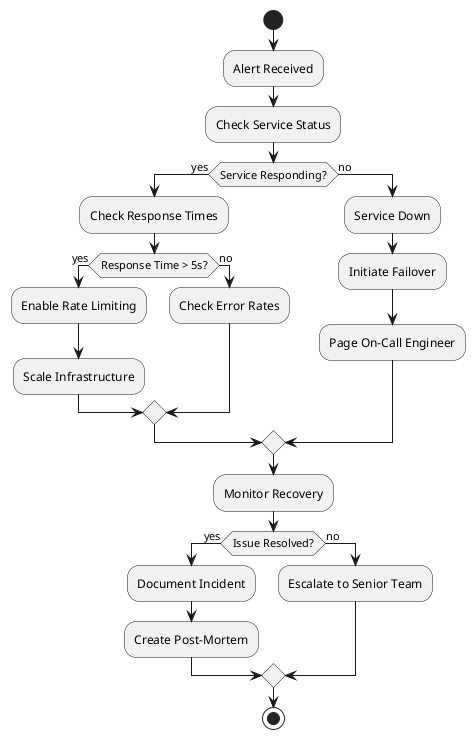

# Operational Runbooks

## Overview

This document provides step-by-step procedures for common operational tasks, incident response, performance tuning, and disaster recovery for Synapse Studio.

## Table of Contents

1. [Common Operations](#common-operations)
2. [Incident Response](#incident-response)
3. [Performance Tuning](#performance-tuning)
4. [Monitoring & Alerting](#monitoring--alerting)
5. [Disaster Recovery](#disaster-recovery)
6. [Maintenance Procedures](#maintenance-procedures)

## Common Operations

### 1. Application Restart

#### Symptoms
- Application unresponsive
- Memory leaks detected
- After configuration changes

#### Procedure

```bash
#!/bin/bash
# Application Restart Runbook

echo "Starting application restart procedure..."

# 1. Check current status
echo "Step 1: Checking current application status"
curl -s https://synapse-studio.com/api/health | jq '.'

# 2. Notify team
echo "Step 2: Notifying team of restart"
# Send notification to Slack/Discord
curl -X POST $SLACK_WEBHOOK_URL \
  -H 'Content-Type: application/json' \
  -d '{"text":"Starting application restart - Maintenance Mode Active"}'

# 3. Enable maintenance mode
echo "Step 3: Enabling maintenance mode"
vercel env pull .env.production.local
echo "NEXT_PUBLIC_MAINTENANCE_MODE=true" >> .env.production.local
vercel env push production

# 4. Wait for active requests to complete
echo "Step 4: Waiting for active requests (30 seconds grace period)"
sleep 30

# 5. Restart application
echo "Step 5: Restarting application"
if [ "$DEPLOYMENT_TYPE" = "vercel" ]; then
    vercel --prod --force
elif [ "$DEPLOYMENT_TYPE" = "docker" ]; then
    docker-compose restart app
elif [ "$DEPLOYMENT_TYPE" = "k8s" ]; then
    kubectl rollout restart deployment/synapse-studio -n production
fi

# 6. Wait for application to be ready
echo "Step 6: Waiting for application to be ready"
for i in {1..60}; do
    if curl -s https://synapse-studio.com/api/health | grep -q "healthy"; then
        echo "Application is healthy"
        break
    fi
    echo "Waiting... ($i/60)"
    sleep 5
done

# 7. Disable maintenance mode
echo "Step 7: Disabling maintenance mode"
sed -i '/NEXT_PUBLIC_MAINTENANCE_MODE/d' .env.production.local
vercel env push production

# 8. Verify application
echo "Step 8: Running health checks"
npm run test:health

# 9. Notify completion
echo "Step 9: Notifying team of completion"
curl -X POST $SLACK_WEBHOOK_URL \
  -H 'Content-Type: application/json' \
  -d '{"text":"Application restart completed successfully"}'

echo "Restart procedure completed"
```

### 2. Database Connection Issues

#### Symptoms
- "Connection refused" errors
- Timeout errors
- High query latency

#### Diagnostic Steps

```bash
#!/bin/bash
# Database Diagnostics Runbook

echo "Running database diagnostics..."

# 1. Test basic connectivity
echo "Test 1: Basic connectivity"
pg_isready -h $DB_HOST -p $DB_PORT

# 2. Test authentication
echo "Test 2: Authentication"
PGPASSWORD=$DB_PASSWORD psql -h $DB_HOST -U $DB_USER -d $DB_NAME -c "SELECT 1"

# 3. Check connection pool
echo "Test 3: Connection pool status"
PGPASSWORD=$DB_PASSWORD psql -h $DB_HOST -U $DB_USER -d $DB_NAME -c "
SELECT count(*) as total_connections,
       count(*) FILTER (WHERE state = 'active') as active,
       count(*) FILTER (WHERE state = 'idle') as idle,
       count(*) FILTER (WHERE state = 'idle in transaction') as idle_in_transaction
FROM pg_stat_activity;"

# 4. Check slow queries
echo "Test 4: Slow queries"
PGPASSWORD=$DB_PASSWORD psql -h $DB_HOST -U $DB_USER -d $DB_NAME -c "
SELECT query, mean_exec_time, calls
FROM pg_stat_statements
WHERE mean_exec_time > 1000
ORDER BY mean_exec_time DESC
LIMIT 10;"

# 5. Check table sizes
echo "Test 5: Table sizes"
PGPASSWORD=$DB_PASSWORD psql -h $DB_HOST -U $DB_USER -d $DB_NAME -c "
SELECT schemaname, tablename, 
       pg_size_pretty(pg_total_relation_size(schemaname||'.'||tablename)) as size
FROM pg_tables
ORDER BY pg_total_relation_size(schemaname||'.'||tablename) DESC
LIMIT 10;"
```

#### Resolution Steps

```bash
#!/bin/bash
# Database Issue Resolution

# 1. Kill idle connections
echo "Killing idle connections older than 1 hour"
PGPASSWORD=$DB_PASSWORD psql -h $DB_HOST -U $DB_USER -d $DB_NAME -c "
SELECT pg_terminate_backend(pid)
FROM pg_stat_activity
WHERE state = 'idle'
AND state_change < NOW() - INTERVAL '1 hour';"

# 2. Vacuum and analyze tables
echo "Running VACUUM ANALYZE"
PGPASSWORD=$DB_PASSWORD psql -h $DB_HOST -U $DB_USER -d $DB_NAME -c "VACUUM ANALYZE;"

# 3. Reset connection pool
echo "Resetting application connection pool"
curl -X POST https://synapse-studio.com/api/admin/reset-db-pool \
  -H "X-Admin-Key: $ADMIN_KEY"

# 4. Monitor recovery
watch -n 5 'pg_isready -h $DB_HOST -p $DB_PORT && echo "Database is ready"'
```

### 3. High Memory Usage

#### Symptoms
- Application slowdown
- Out of memory errors
- Container restarts

#### Investigation

```typescript
// Memory diagnostics endpoint
// app/api/admin/memory/route.ts
export async function GET(request: Request) {
  // Verify admin access
  const isAdmin = await verifyAdminAccess(request);
  if (!isAdmin) {
    return new Response('Unauthorized', { status: 401 });
  }
  
  const memoryUsage = process.memoryUsage();
  const formatBytes = (bytes: number) => (bytes / 1024 / 1024).toFixed(2) + ' MB';
  
  return Response.json({
    rss: formatBytes(memoryUsage.rss),          // Resident Set Size
    heapTotal: formatBytes(memoryUsage.heapTotal),
    heapUsed: formatBytes(memoryUsage.heapUsed),
    external: formatBytes(memoryUsage.external),
    arrayBuffers: formatBytes(memoryUsage.arrayBuffers),
    
    // System info
    platform: process.platform,
    nodeVersion: process.version,
    uptime: process.uptime(),
    
    // Detailed heap statistics
    heapStatistics: v8.getHeapStatistics(),
    
    // Active handles and requests
    activeHandles: process._getActiveHandles?.().length,
    activeRequests: process._getActiveRequests?.().length
  });
}
```

#### Resolution

```bash
#!/bin/bash
# Memory Issue Resolution

# 1. Identify memory leaks
echo "Generating heap snapshot..."
curl -X POST https://synapse-studio.com/api/admin/heap-snapshot \
  -H "X-Admin-Key: $ADMIN_KEY" \
  -o heap-$(date +%Y%m%d-%H%M%S).heapsnapshot

# 2. Restart with increased memory (temporary fix)
if [ "$DEPLOYMENT_TYPE" = "docker" ]; then
    docker-compose down
    docker-compose up -d --scale app=2  # Scale horizontally
    
elif [ "$DEPLOYMENT_TYPE" = "k8s" ]; then
    # Increase memory limits
    kubectl set resources deployment/synapse-studio \
      --limits=memory=4Gi \
      --requests=memory=2Gi \
      -n production
    
    # Scale horizontally
    kubectl scale deployment/synapse-studio --replicas=5 -n production
fi

# 3. Clear caches
echo "Clearing application caches..."
curl -X POST https://synapse-studio.com/api/admin/clear-cache \
  -H "X-Admin-Key: $ADMIN_KEY"

# 4. Monitor memory usage
watch -n 10 'curl -s https://synapse-studio.com/api/admin/memory \
  -H "X-Admin-Key: $ADMIN_KEY" | jq .'
```

## Incident Response

### 1. API Service Degradation

#### Detection
- Response times > 5 seconds
- Error rate > 5%
- 5xx errors spike

#### Response Procedure



#### Runbook

```bash
#!/bin/bash
# API Degradation Response

# 1. Assess current state
echo "=== API Health Check ==="
curl -w "\n
  Response Code: %{http_code}
  Total Time: %{time_total}s
  Connect Time: %{time_connect}s
  TTFB: %{time_starttransfer}s\n" \
  -o /dev/null -s \
  https://synapse-studio.com/api/health

# 2. Check error rates
echo "=== Error Rate Check ==="
# Query logs for 5xx errors in last 5 minutes
if [ "$LOG_PROVIDER" = "vercel" ]; then
    vercel logs --prod --since 5m | grep -c "5[0-9][0-9]"
fi

# 3. Enable emergency rate limiting
echo "=== Enabling Strict Rate Limiting ==="
curl -X POST https://synapse-studio.com/api/admin/rate-limit \
  -H "X-Admin-Key: $ADMIN_KEY" \
  -H "Content-Type: application/json" \
  -d '{
    "enabled": true,
    "requests_per_minute": 5,
    "burst": 10
  }'

# 4. Scale infrastructure
echo "=== Scaling Infrastructure ==="
if [ "$DEPLOYMENT_TYPE" = "vercel" ]; then
    # Vercel auto-scales
    echo "Vercel auto-scaling active"
    
elif [ "$DEPLOYMENT_TYPE" = "k8s" ]; then
    # Scale to handle load
    kubectl scale deployment/synapse-studio --replicas=10 -n production
    
    # Enable HPA if not already
    kubectl autoscale deployment/synapse-studio \
      --min=3 --max=20 --cpu-percent=50 -n production
fi

# 5. Clear problematic cache entries
echo "=== Clearing Caches ==="
curl -X POST https://synapse-studio.com/api/admin/clear-cache \
  -H "X-Admin-Key: $ADMIN_KEY"

# 6. Monitor recovery
echo "=== Monitoring Recovery ==="
for i in {1..30}; do
    response=$(curl -s -w "%{http_code}" https://synapse-studio.com/api/health -o /dev/null)
    if [ "$response" = "200" ]; then
        echo "✓ API responding normally"
        break
    else
        echo "✗ API still degraded (attempt $i/30)"
        sleep 10
    fi
done
```

### 2. Data Breach Response

#### Immediate Actions

```bash
#!/bin/bash
# Data Breach Immediate Response

# CRITICAL: Run immediately upon detection

# 1. Isolate the breach
echo "STEP 1: Isolating affected systems"
# Revoke all API keys
curl -X POST https://synapse-studio.com/api/admin/revoke-all-keys \
  -H "X-Admin-Key: $ADMIN_KEY"

# Force logout all users
curl -X POST https://synapse-studio.com/api/admin/logout-all-users \
  -H "X-Admin-Key: $ADMIN_KEY"

# 2. Preserve evidence
echo "STEP 2: Preserving evidence"
# Snapshot logs
mkdir -p /emergency/breach-$(date +%Y%m%d-%H%M%S)
cd /emergency/breach-*

# Export recent logs
if [ "$DEPLOYMENT_TYPE" = "vercel" ]; then
    vercel logs --prod --since 24h > access.log
fi

# Export audit logs
curl https://synapse-studio.com/api/admin/audit-logs?hours=48 \
  -H "X-Admin-Key: $ADMIN_KEY" > audit.log

# 3. Block suspicious IPs
echo "STEP 3: Blocking suspicious activity"
# Extract suspicious IPs from logs
grep -E "401|403|429" access.log | \
  awk '{print $1}' | \
  sort | uniq -c | sort -rn | \
  head -20 > suspicious_ips.txt

# Block IPs
while read -r count ip; do
    if [ "$count" -gt 100 ]; then
        echo "Blocking IP: $ip (${count} suspicious requests)"
        curl -X POST https://synapse-studio.com/api/admin/block-ip \
          -H "X-Admin-Key: $ADMIN_KEY" \
          -H "Content-Type: application/json" \
          -d "{\"ip\": \"$ip\"}"
    fi
done < suspicious_ips.txt

# 4. Reset all passwords
echo "STEP 4: Forcing password resets"
curl -X POST https://synapse-studio.com/api/admin/force-password-reset \
  -H "X-Admin-Key: $ADMIN_KEY"

# 5. Notify stakeholders
echo "STEP 5: Sending notifications"
# Send to security team
curl -X POST $SECURITY_WEBHOOK_URL \
  -H 'Content-Type: application/json' \
  -d '{
    "text": "🚨 SECURITY INCIDENT: Potential data breach detected. Immediate response initiated.",
    "priority": "critical"
  }'

echo "Immediate response complete. Begin investigation phase."
```

## Performance Tuning

### 1. Database Query Optimization

#### Identify Slow Queries

```sql
-- Find slowest queries
SELECT 
    query,
    mean_exec_time,
    total_exec_time,
    calls,
    mean_exec_time/1000 as mean_seconds,
    total_exec_time/1000 as total_seconds
FROM pg_stat_statements
WHERE query NOT LIKE '%pg_stat_statements%'
ORDER BY mean_exec_time DESC
LIMIT 20;

-- Find missing indexes
SELECT
    schemaname,
    tablename,
    attname,
    n_distinct,
    correlation
FROM pg_stats
WHERE schemaname = 'public'
AND n_distinct > 100
AND correlation < 0.1
ORDER BY n_distinct DESC;

-- Analyze table statistics
ANALYZE VERBOSE;
```

#### Create Optimized Indexes

```sql
-- Create indexes for common queries
CREATE INDEX CONCURRENTLY idx_media_project_created 
ON media_items(project_id, created_at DESC);

CREATE INDEX CONCURRENTLY idx_keyframes_track_timestamp 
ON video_keyframes(track_id, timestamp);

CREATE INDEX CONCURRENTLY idx_audit_user_timestamp 
ON audit_logs(user_id, timestamp DESC);

-- Partial indexes for filtered queries
CREATE INDEX CONCURRENTLY idx_media_pending 
ON media_items(status) 
WHERE status = 'pending';

-- Composite indexes for joins
CREATE INDEX CONCURRENTLY idx_project_user_updated 
ON video_projects(user_id, updated_at DESC);
```

### 2. Application Performance

#### Bundle Size Optimization

```bash
#!/bin/bash
# Bundle Analysis and Optimization

# 1. Analyze current bundle
echo "Analyzing bundle size..."
ANALYZE=true npm run build > bundle-analysis.txt

# 2. Find large dependencies
echo "Large dependencies (>100KB):"
npm list --depth=0 --json | jq '.dependencies | to_entries[] | 
  select(.value.size > 100000) | 
  {name: .key, size: .value.size}'

# 3. Check for duplicates
echo "Checking for duplicate packages..."
npm dedupe
npm ls --depth=0 | grep deduped

# 4. Find unused dependencies
echo "Checking for unused dependencies..."
npx depcheck

# 5. Optimize images
echo "Optimizing images..."
find public -type f \( -name "*.jpg" -o -name "*.png" \) -exec \
  npx imagemin {} --out-dir=public/optimized \;

# 6. Enable compression
echo "Checking compression settings..."
grep -r "compress\|gzip\|brotli" next.config.mjs vercel.json
```

#### React Performance Optimization

```typescript
// Performance monitoring component
import { Profiler, ProfilerOnRenderCallback } from 'react';

const onRenderCallback: ProfilerOnRenderCallback = (
  id,
  phase,
  actualDuration,
  baseDuration,
  startTime,
  commitTime,
  interactions
) => {
  // Log slow renders
  if (actualDuration > 16) { // Over 1 frame (60fps)
    console.warn(`Slow render detected in ${id}:`, {
      phase,
      actualDuration,
      baseDuration,
      renderTime: actualDuration.toFixed(2) + 'ms'
    });
    
    // Send to monitoring
    if (process.env.NODE_ENV === 'production') {
      sendToAnalytics('slow_render', {
        component: id,
        duration: actualDuration,
        phase
      });
    }
  }
};

// Wrap components with profiler
export function withPerformanceMonitoring<P>(
  Component: React.ComponentType<P>,
  id: string
) {
  return (props: P) => (
    <Profiler id={id} onRender={onRenderCallback}>
      <Component {...props} />
    </Profiler>
  );
}
```

### 3. Caching Strategy

#### CDN Cache Configuration

```nginx
# nginx cache configuration
proxy_cache_path /var/cache/nginx levels=1:2 keys_zone=app_cache:10m max_size=10g inactive=60m;

server {
    location ~* \.(jpg|jpeg|png|gif|ico|css|js|woff2)$ {
        proxy_cache app_cache;
        proxy_cache_valid 200 302 1y;
        proxy_cache_valid 404 1m;
        expires 1y;
        add_header Cache-Control "public, immutable";
        add_header X-Cache-Status $upstream_cache_status;
    }
    
    location /_next/static/ {
        proxy_cache app_cache;
        proxy_cache_valid 200 1y;
        expires 1y;
        add_header Cache-Control "public, immutable";
    }
    
    location /api/ {
        proxy_cache app_cache;
        proxy_cache_key "$request_method$request_uri$http_authorization";
        proxy_cache_valid 200 1m;
        proxy_cache_methods GET HEAD;
        add_header X-Cache-Status $upstream_cache_status;
    }
}
```

## Monitoring & Alerting

### 1. Health Check Configuration

```typescript
// Comprehensive health check system
interface HealthCheck {
  name: string;
  check: () => Promise<HealthStatus>;
  critical: boolean;
  timeout: number;
}

const healthChecks: HealthCheck[] = [
  {
    name: 'database',
    critical: true,
    timeout: 5000,
    check: async () => {
      const start = Date.now();
      try {
        await db.query('SELECT 1');
        return {
          status: 'healthy',
          latency: Date.now() - start
        };
      } catch (error) {
        return {
          status: 'unhealthy',
          error: error.message
        };
      }
    }
  },
  {
    name: 'storage',
    critical: true,
    timeout: 10000,
    check: async () => {
      try {
        const testFile = await storage.head('health-check.txt');
        return { status: 'healthy' };
      } catch (error) {
        return {
          status: 'unhealthy',
          error: error.message
        };
      }
    }
  },
  {
    name: 'fal-api',
    critical: false,
    timeout: 15000,
    check: async () => {
      try {
        const response = await fetch('https://fal.ai/api/health');
        return {
          status: response.ok ? 'healthy' : 'degraded'
        };
      } catch (error) {
        return {
          status: 'degraded',
          error: error.message
        };
      }
    }
  }
];

// Run health checks
export async function runHealthChecks() {
  const results = await Promise.all(
    healthChecks.map(async (check) => {
      try {
        const result = await Promise.race([
          check.check(),
          new Promise<HealthStatus>((_, reject) =>
            setTimeout(() => reject(new Error('Timeout')), check.timeout)
          )
        ]);
        return { name: check.name, ...result };
      } catch (error) {
        return {
          name: check.name,
          status: 'unhealthy',
          error: error.message
        };
      }
    })
  );
  
  const overallStatus = results.every(r => 
    r.status === 'healthy' || (!healthChecks.find(h => h.name === r.name)?.critical)
  ) ? 'healthy' : 'unhealthy';
  
  return {
    status: overallStatus,
    checks: results,
    timestamp: new Date().toISOString()
  };
}
```

### 2. Alert Configuration

```yaml
# Alerting rules configuration
alerts:
  - name: high_error_rate
    condition: error_rate > 0.05
    duration: 5m
    severity: critical
    channels: [pagerduty, slack]
    message: "Error rate exceeded 5% for 5 minutes"
    
  - name: high_response_time
    condition: p95_latency > 3000
    duration: 10m
    severity: warning
    channels: [slack]
    message: "P95 latency exceeded 3s for 10 minutes"
    
  - name: low_disk_space
    condition: disk_usage > 0.9
    duration: 1m
    severity: critical
    channels: [pagerduty, email]
    message: "Disk usage exceeded 90%"
    
  - name: database_connections
    condition: connection_count > 90
    duration: 5m
    severity: warning
    channels: [slack]
    message: "Database connections near limit"
    
  - name: memory_usage
    condition: memory_usage > 0.85
    duration: 5m
    severity: warning
    channels: [slack]
    message: "Memory usage exceeded 85%"
```

## Disaster Recovery

### 1. Full System Recovery

```bash
#!/bin/bash
# Complete Disaster Recovery Procedure

# Prerequisites:
# - Access to backup storage
# - Infrastructure provisioned
# - DNS control

echo "=== DISASTER RECOVERY PROCEDURE ==="
echo "Starting at $(date)"

# 1. Verify backups
echo "Step 1: Verifying backup availability"
aws s3 ls s3://synapse-backup/ --recursive | tail -20

# 2. Restore database
echo "Step 2: Restoring database from backup"
LATEST_DB_BACKUP=$(aws s3 ls s3://synapse-backup/db/ | sort | tail -1 | awk '{print $4}')
echo "Using backup: $LATEST_DB_BACKUP"

aws s3 cp s3://synapse-backup/db/$LATEST_DB_BACKUP ./
gunzip < $LATEST_DB_BACKUP | psql $NEW_DATABASE_URL

# 3. Restore media files
echo "Step 3: Restoring media files"
LATEST_MEDIA_BACKUP=$(aws s3 ls s3://synapse-backup/media/ | sort | tail -1 | awk '{print $4}')
aws s3 sync s3://synapse-backup/media/$LATEST_MEDIA_BACKUP s3://synapse-media-new/

# 4. Deploy application
echo "Step 4: Deploying application"
git clone https://github.com/your-org/synapse-studio.git
cd synapse-studio

# Restore configuration
aws s3 cp s3://synapse-backup/config/latest.env .env.production

# Deploy
npm install
npm run build
vercel --prod

# 5. Update DNS
echo "Step 5: Updating DNS records"
# Update DNS to point to new infrastructure
# This is provider-specific

# 6. Verify recovery
echo "Step 6: Running verification tests"
npm run test:e2e:production

# 7. Monitor
echo "Step 7: Monitoring recovery"
watch -n 10 'curl -s https://synapse-studio.com/api/health | jq .'

echo "Recovery procedure completed at $(date)"
```

### 2. Rollback Procedure

```bash
#!/bin/bash
# Emergency Rollback Procedure

echo "=== EMERGENCY ROLLBACK ==="

# 1. Identify last known good deployment
echo "Finding last stable deployment..."
if [ "$DEPLOYMENT_TYPE" = "vercel" ]; then
    vercel list --prod | head -5
    read -p "Enter deployment URL to rollback to: " ROLLBACK_URL
    vercel alias set synapse-studio.com $ROLLBACK_URL
    
elif [ "$DEPLOYMENT_TYPE" = "k8s" ]; then
    kubectl rollout history deployment/synapse-studio -n production
    read -p "Enter revision number to rollback to: " REVISION
    kubectl rollout undo deployment/synapse-studio --to-revision=$REVISION -n production
    kubectl rollout status deployment/synapse-studio -n production
fi

# 2. Verify rollback
echo "Verifying rollback..."
sleep 30
curl https://synapse-studio.com/api/health

# 3. Clear caches
echo "Clearing CDN caches..."
# CloudFlare example
curl -X POST "https://api.cloudflare.com/client/v4/zones/$CF_ZONE_ID/purge_cache" \
  -H "Authorization: Bearer $CF_API_TOKEN" \
  -H "Content-Type: application/json" \
  -d '{"purge_everything":true}'

echo "Rollback completed"
```

## Maintenance Procedures

### 1. Scheduled Maintenance

```bash
#!/bin/bash
# Scheduled Maintenance Procedure

# Run during low-traffic window (e.g., 2 AM UTC)

echo "=== SCHEDULED MAINTENANCE ==="
echo "Starting at $(date)"

# 1. Enable maintenance mode
echo "Enabling maintenance mode..."
vercel env add NEXT_PUBLIC_MAINTENANCE_MODE true production

# 2. Backup current state
echo "Creating backup..."
pg_dump $DATABASE_URL | gzip > backup_pre_maintenance_$(date +%Y%m%d).sql.gz

# 3. Run database maintenance
echo "Running database maintenance..."
PGPASSWORD=$DB_PASSWORD psql -h $DB_HOST -U $DB_USER -d $DB_NAME <<EOF
-- Vacuum and analyze all tables
VACUUM ANALYZE;

-- Reindex tables
REINDEX DATABASE $DB_NAME;

-- Update statistics
ANALYZE;
EOF

# 4. Update dependencies
echo "Updating dependencies..."
npm update
npm audit fix

# 5. Deploy updates
echo "Deploying updates..."
npm run build
vercel --prod

# 6. Run migrations
echo "Running database migrations..."
npm run migrate:up

# 7. Clear caches
echo "Clearing caches..."
curl -X POST https://synapse-studio.com/api/admin/clear-cache \
  -H "X-Admin-Key: $ADMIN_KEY"

# 8. Disable maintenance mode
echo "Disabling maintenance mode..."
vercel env rm NEXT_PUBLIC_MAINTENANCE_MODE production

# 9. Verify
echo "Running verification..."
npm run test:smoke

echo "Maintenance completed at $(date)"
```

### 2. Log Rotation

```bash
#!/bin/bash
# Log Rotation Procedure

# Run daily via cron
# 0 2 * * * /path/to/log-rotation.sh

echo "Starting log rotation..."

# Define log directories
LOG_DIRS=(
    "/var/log/synapse"
    "/var/log/nginx"
    "/app/logs"
)

# Rotate logs
for dir in "${LOG_DIRS[@]}"; do
    echo "Rotating logs in $dir"
    
    # Find logs older than 7 days
    find $dir -name "*.log" -mtime +7 -exec gzip {} \;
    
    # Move to archive
    find $dir -name "*.log.gz" -exec mv {} /archive/logs/ \;
    
    # Delete archives older than 30 days
    find /archive/logs -name "*.log.gz" -mtime +30 -delete
done

# Upload to S3 for long-term storage
echo "Uploading to S3..."
aws s3 sync /archive/logs s3://synapse-logs/archive/

echo "Log rotation completed"
```

## Troubleshooting Guide

### Common Issues Quick Reference

| Issue | Quick Check | Resolution |
|-------|------------|------------|
| 502 Bad Gateway | `curl -I https://synapse-studio.com` | Restart application |
| Database Connection Failed | `pg_isready -h $DB_HOST` | Check connection string |
| High Memory Usage | `docker stats` or `kubectl top pods` | Scale horizontally |
| Slow API Response | Check `/api/admin/metrics` | Enable caching |
| File Upload Fails | Check storage quota | Increase limits |
| Authentication Issues | Check session store | Clear sessions |
| Rate Limiting | Check rate limit headers | Adjust limits |

### Debug Commands

```bash
# Quick health check
curl https://synapse-studio.com/api/health | jq '.'

# Check logs
vercel logs --prod --since 1h | grep ERROR

# Database status
PGPASSWORD=$DB_PASSWORD psql -h $DB_HOST -U $DB_USER -d $DB_NAME -c "SELECT version();"

# Container status
docker ps -a | grep synapse

# Kubernetes pods
kubectl get pods -n production

# Network connectivity
traceroute synapse-studio.com

# DNS resolution
dig synapse-studio.com

# SSL certificate
openssl s_client -connect synapse-studio.com:443 -servername synapse-studio.com
```