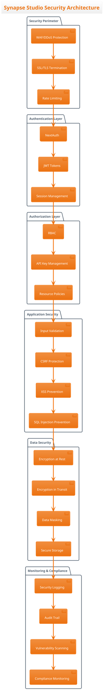
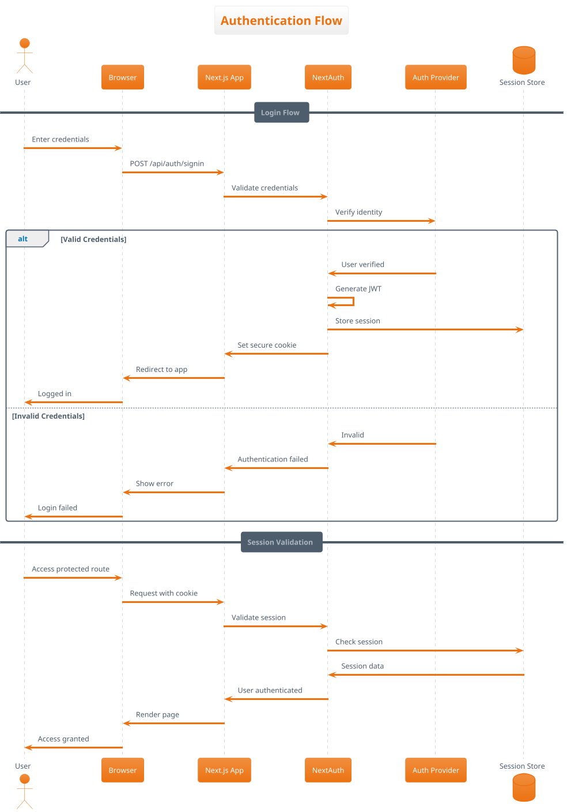

# Security Architecture

## Overview

This document outlines the comprehensive security architecture of Synapse Studio, covering authentication, authorization, data protection, API security, and compliance measures.

## Security Architecture Overview



## Authentication Architecture

### Authentication Flow



### JWT Token Structure

```typescript
// JWT Token payload structure
interface JWTPayload {
  // Standard claims
  sub: string;          // User ID
  iat: number;          // Issued at
  exp: number;          // Expiration
  nbf: number;          // Not before
  
  // Custom claims
  user: {
    id: string;
    email: string;
    name: string;
    role: UserRole;
    permissions: Permission[];
  };
  
  // Security metadata
  sessionId: string;
  fingerprint: string;  // Browser fingerprint
  ipAddress: string;
  userAgent: string;
}

// Token configuration
const tokenConfig = {
  secret: process.env.JWT_SECRET,
  algorithm: 'HS256',
  expiresIn: '24h',
  issuer: 'synapse-studio',
  audience: 'synapse-studio-users'
};
```

### Multi-Factor Authentication (MFA)

```typescript
// MFA implementation
interface MFAConfig {
  enabled: boolean;
  methods: ('totp' | 'sms' | 'email' | 'webauthn')[];
  backupCodes: number;
  gracePeriod: number; // seconds
}

// TOTP (Time-based One-Time Password)
class TOTPAuthenticator {
  generateSecret(): string {
    return speakeasy.generateSecret({
      name: 'Synapse Studio',
      length: 32
    }).base32;
  }
  
  verifyToken(secret: string, token: string): boolean {
    return speakeasy.totp.verify({
      secret,
      encoding: 'base32',
      token,
      window: 2 // Allow 2 time steps tolerance
    });
  }
  
  generateQRCode(secret: string, email: string): string {
    const otpauth = speakeasy.otpauthURL({
      secret,
      label: email,
      issuer: 'Synapse Studio',
      encoding: 'base32'
    });
    return qrcode.toDataURL(otpauth);
  }
}
```

## Authorization Architecture

### Role-Based Access Control (RBAC)

```typescript
// Role and permission definitions
enum Role {
  SUPER_ADMIN = 'super_admin',
  ADMIN = 'admin',
  EDITOR = 'editor',
  VIEWER = 'viewer',
  GUEST = 'guest'
}

enum Permission {
  // Project permissions
  PROJECT_CREATE = 'project:create',
  PROJECT_READ = 'project:read',
  PROJECT_UPDATE = 'project:update',
  PROJECT_DELETE = 'project:delete',
  
  // Media permissions
  MEDIA_UPLOAD = 'media:upload',
  MEDIA_GENERATE = 'media:generate',
  MEDIA_DELETE = 'media:delete',
  
  // Admin permissions
  USER_MANAGE = 'user:manage',
  SETTINGS_MANAGE = 'settings:manage',
  API_KEY_MANAGE = 'api_key:manage'
}

// Role-permission mapping
const rolePermissions: Record<Role, Permission[]> = {
  [Role.SUPER_ADMIN]: Object.values(Permission),
  [Role.ADMIN]: [
    Permission.PROJECT_CREATE,
    Permission.PROJECT_READ,
    Permission.PROJECT_UPDATE,
    Permission.PROJECT_DELETE,
    Permission.MEDIA_UPLOAD,
    Permission.MEDIA_GENERATE,
    Permission.MEDIA_DELETE,
    Permission.USER_MANAGE
  ],
  [Role.EDITOR]: [
    Permission.PROJECT_CREATE,
    Permission.PROJECT_READ,
    Permission.PROJECT_UPDATE,
    Permission.MEDIA_UPLOAD,
    Permission.MEDIA_GENERATE
  ],
  [Role.VIEWER]: [
    Permission.PROJECT_READ
  ],
  [Role.GUEST]: []
};
```

### Resource-Level Authorization

```typescript
// Resource authorization checker
class AuthorizationService {
  async canAccessResource(
    userId: string,
    resourceType: string,
    resourceId: string,
    action: string
  ): Promise<boolean> {
    // Check user permissions
    const user = await getUser(userId);
    const hasPermission = this.hasPermission(user, `${resourceType}:${action}`);
    
    if (!hasPermission) return false;
    
    // Check resource ownership
    const resource = await getResource(resourceType, resourceId);
    if (resource.ownerId === userId) return true;
    
    // Check sharing permissions
    const sharing = await getResourceSharing(resourceId);
    return sharing.sharedWith.includes(userId);
  }
  
  hasPermission(user: User, permission: Permission): boolean {
    const userPermissions = rolePermissions[user.role] || [];
    return userPermissions.includes(permission);
  }
}
```

## API Security

### API Authentication Methods

```typescript
// API authentication middleware
export async function authenticateAPI(
  request: NextRequest
): Promise<AuthResult> {
  // 1. Check session cookie
  const session = await getServerSession();
  if (session) {
    return { authenticated: true, user: session.user };
  }
  
  // 2. Check API key
  const apiKey = request.headers.get('X-API-Key');
  if (apiKey) {
    const keyData = await validateAPIKey(apiKey);
    if (keyData) {
      return { authenticated: true, apiKey: keyData };
    }
  }
  
  // 3. Check Bearer token
  const authHeader = request.headers.get('Authorization');
  if (authHeader?.startsWith('Bearer ')) {
    const token = authHeader.substring(7);
    const payload = await verifyJWT(token);
    if (payload) {
      return { authenticated: true, user: payload.user };
    }
  }
  
  return { authenticated: false };
}
```

### Rate Limiting Strategy

```typescript
// Rate limiting configuration
interface RateLimitConfig {
  windowMs: number;      // Time window in milliseconds
  maxRequests: number;   // Max requests per window
  skipSuccessfulRequests: boolean;
  keyGenerator: (req: Request) => string;
}

// Rate limit rules by endpoint
const rateLimitRules: Record<string, RateLimitConfig> = {
  '/api/auth/signin': {
    windowMs: 15 * 60 * 1000, // 15 minutes
    maxRequests: 5,
    skipSuccessfulRequests: false,
    keyGenerator: (req) => getClientIP(req)
  },
  '/api/fal': {
    windowMs: 60 * 1000, // 1 minute
    maxRequests: 10,
    skipSuccessfulRequests: false,
    keyGenerator: (req) => getUserId(req) || getClientIP(req)
  },
  '/api/uploadthing': {
    windowMs: 60 * 1000, // 1 minute
    maxRequests: 20,
    skipSuccessfulRequests: true,
    keyGenerator: (req) => getUserId(req)
  }
};

// Rate limiter implementation
class RateLimiter {
  private store = new Map<string, number[]>();
  
  async checkLimit(
    key: string,
    config: RateLimitConfig
  ): Promise<RateLimitResult> {
    const now = Date.now();
    const timestamps = this.store.get(key) || [];
    
    // Remove old timestamps
    const validTimestamps = timestamps.filter(
      t => now - t < config.windowMs
    );
    
    if (validTimestamps.length >= config.maxRequests) {
      const oldestTimestamp = validTimestamps[0];
      const resetTime = oldestTimestamp + config.windowMs;
      
      return {
        allowed: false,
        remaining: 0,
        resetTime,
        retryAfter: Math.ceil((resetTime - now) / 1000)
      };
    }
    
    validTimestamps.push(now);
    this.store.set(key, validTimestamps);
    
    return {
      allowed: true,
      remaining: config.maxRequests - validTimestamps.length,
      resetTime: now + config.windowMs
    };
  }
}
```

### Input Validation & Sanitization

```typescript
// Input validation schemas
import { z } from 'zod';

// Sanitization helpers
const sanitizers = {
  // Remove HTML tags and scripts
  html: (input: string) => {
    return DOMPurify.sanitize(input, {
      ALLOWED_TAGS: [],
      ALLOWED_ATTR: []
    });
  },
  
  // SQL injection prevention
  sql: (input: string) => {
    return input.replace(/['";\\]/g, '');
  },
  
  // Path traversal prevention
  path: (input: string) => {
    return input.replace(/\.\./g, '').replace(/[\/\\]/g, '');
  },
  
  // Command injection prevention
  command: (input: string) => {
    return input.replace(/[;&|`$()]/g, '');
  }
};

// Validation middleware
export function validateRequest(schema: z.ZodSchema) {
  return async (req: Request) => {
    const body = await req.json();
    
    // Validate structure
    const validation = schema.safeParse(body);
    if (!validation.success) {
      throw new ValidationError(validation.error);
    }
    
    // Sanitize strings
    const sanitized = sanitizeObject(validation.data);
    
    return sanitized;
  };
}

// Deep object sanitization
function sanitizeObject(obj: any): any {
  if (typeof obj === 'string') {
    return sanitizers.html(obj);
  }
  
  if (Array.isArray(obj)) {
    return obj.map(sanitizeObject);
  }
  
  if (obj && typeof obj === 'object') {
    const sanitized: any = {};
    for (const [key, value] of Object.entries(obj)) {
      sanitized[sanitizers.path(key)] = sanitizeObject(value);
    }
    return sanitized;
  }
  
  return obj;
}
```

## Data Protection

### Encryption Strategy

```typescript
// Encryption configuration
interface EncryptionConfig {
  algorithm: 'aes-256-gcm';
  keyDerivation: 'pbkdf2';
  iterations: 100000;
  saltLength: 32;
  tagLength: 16;
  ivLength: 16;
}

// Field-level encryption
class FieldEncryption {
  private key: Buffer;
  
  constructor(masterKey: string) {
    this.key = crypto.pbkdf2Sync(
      masterKey,
      'synapse-studio-salt',
      100000,
      32,
      'sha256'
    );
  }
  
  encrypt(plaintext: string): EncryptedData {
    const iv = crypto.randomBytes(16);
    const cipher = crypto.createCipheriv('aes-256-gcm', this.key, iv);
    
    let encrypted = cipher.update(plaintext, 'utf8', 'hex');
    encrypted += cipher.final('hex');
    
    const tag = cipher.getAuthTag();
    
    return {
      encrypted,
      iv: iv.toString('hex'),
      tag: tag.toString('hex')
    };
  }
  
  decrypt(data: EncryptedData): string {
    const decipher = crypto.createDecipheriv(
      'aes-256-gcm',
      this.key,
      Buffer.from(data.iv, 'hex')
    );
    
    decipher.setAuthTag(Buffer.from(data.tag, 'hex'));
    
    let decrypted = decipher.update(data.encrypted, 'hex', 'utf8');
    decrypted += decipher.final('utf8');
    
    return decrypted;
  }
}
```

### Data Classification & Handling

```typescript
// Data classification levels
enum DataClassification {
  PUBLIC = 'public',           // No restrictions
  INTERNAL = 'internal',       // Internal use only
  CONFIDENTIAL = 'confidential', // Restricted access
  SENSITIVE = 'sensitive',     // PII/PHI data
  SECRET = 'secret'           // Highest protection
}

// Data handling policies
const dataHandlingPolicies: Record<DataClassification, DataPolicy> = {
  [DataClassification.PUBLIC]: {
    encryption: false,
    audit: false,
    retention: null,
    access: 'unrestricted'
  },
  [DataClassification.INTERNAL]: {
    encryption: false,
    audit: true,
    retention: 365, // days
    access: 'authenticated'
  },
  [DataClassification.CONFIDENTIAL]: {
    encryption: true,
    audit: true,
    retention: 730,
    access: 'authorized'
  },
  [DataClassification.SENSITIVE]: {
    encryption: true,
    audit: true,
    retention: 2555,
    access: 'need-to-know',
    anonymization: true
  },
  [DataClassification.SECRET]: {
    encryption: true,
    audit: true,
    retention: 3650,
    access: 'privileged',
    mfa: true
  }
};
```

### Secure Storage

```typescript
// Secure storage implementation
class SecureStorage {
  private encryption: FieldEncryption;
  
  constructor(masterKey: string) {
    this.encryption = new FieldEncryption(masterKey);
  }
  
  async storeSecure(
    key: string,
    data: any,
    classification: DataClassification
  ): Promise<void> {
    const policy = dataHandlingPolicies[classification];
    
    // Serialize data
    let serialized = JSON.stringify(data);
    
    // Encrypt if required
    if (policy.encryption) {
      const encrypted = this.encryption.encrypt(serialized);
      serialized = JSON.stringify(encrypted);
    }
    
    // Store with metadata
    await storage.set(key, {
      data: serialized,
      classification,
      createdAt: new Date(),
      expiresAt: policy.retention 
        ? addDays(new Date(), policy.retention)
        : null
    });
    
    // Audit log
    if (policy.audit) {
      await auditLog.record({
        action: 'STORE',
        key,
        classification,
        userId: getCurrentUserId()
      });
    }
  }
  
  async retrieveSecure(
    key: string
  ): Promise<any> {
    const stored = await storage.get(key);
    if (!stored) return null;
    
    const policy = dataHandlingPolicies[stored.classification];
    
    // Check expiration
    if (stored.expiresAt && new Date() > stored.expiresAt) {
      await this.deleteSecure(key);
      return null;
    }
    
    // Decrypt if encrypted
    let data = stored.data;
    if (policy.encryption) {
      const encrypted = JSON.parse(data);
      data = this.encryption.decrypt(encrypted);
    }
    
    // Audit log
    if (policy.audit) {
      await auditLog.record({
        action: 'RETRIEVE',
        key,
        classification: stored.classification,
        userId: getCurrentUserId()
      });
    }
    
    return JSON.parse(data);
  }
  
  async deleteSecure(key: string): Promise<void> {
    const stored = await storage.get(key);
    if (!stored) return;
    
    const policy = dataHandlingPolicies[stored.classification];
    
    // Secure deletion
    await storage.delete(key);
    
    // Audit log
    if (policy.audit) {
      await auditLog.record({
        action: 'DELETE',
        key,
        classification: stored.classification,
        userId: getCurrentUserId()
      });
    }
  }
}
```

## Security Headers

### Content Security Policy (CSP)

```typescript
// CSP configuration
const cspDirectives = {
  'default-src': ["'self'"],
  'script-src': [
    "'self'",
    "'unsafe-inline'", // Required for Next.js
    "'unsafe-eval'",   // Required for development
    "https://vercel.live",
    "https://analytics.vercel.com"
  ],
  'style-src': [
    "'self'",
    "'unsafe-inline'", // Required for styled-jsx
    "https://fonts.googleapis.com"
  ],
  'img-src': [
    "'self'",
    "data:",
    "blob:",
    "https://*.supabase.co",
    "https://utfs.io",
    "https://fal.ai"
  ],
  'font-src': [
    "'self'",
    "https://fonts.gstatic.com"
  ],
  'connect-src': [
    "'self'",
    "https://*.supabase.co",
    "https://api.uploadthing.com",
    "https://fal.ai",
    "wss://*.supabase.co"
  ],
  'media-src': [
    "'self'",
    "blob:",
    "https://*.supabase.co",
    "https://utfs.io"
  ],
  'object-src': ["'none'"],
  'base-uri': ["'self'"],
  'form-action': ["'self'"],
  'frame-ancestors': ["'none'"],
  'upgrade-insecure-requests': []
};

// Generate CSP header
function generateCSP(): string {
  return Object.entries(cspDirectives)
    .map(([key, values]) => {
      if (values.length === 0) return key;
      return `${key} ${values.join(' ')}`;
    })
    .join('; ');
}
```

### Security Headers Implementation

```typescript
// middleware.ts
export function middleware(request: NextRequest) {
  const response = NextResponse.next();
  
  // Security headers
  const securityHeaders = {
    // XSS Protection
    'X-XSS-Protection': '1; mode=block',
    'X-Content-Type-Options': 'nosniff',
    
    // Clickjacking Protection
    'X-Frame-Options': 'DENY',
    
    // HTTPS Enforcement
    'Strict-Transport-Security': 'max-age=31536000; includeSubDomains; preload',
    
    // Referrer Policy
    'Referrer-Policy': 'strict-origin-when-cross-origin',
    
    // Permissions Policy
    'Permissions-Policy': 'camera=(), microphone=(), geolocation=(), payment=()',
    
    // CSP
    'Content-Security-Policy': generateCSP(),
    
    // CORS
    'Access-Control-Allow-Origin': process.env.ALLOWED_ORIGINS || '*',
    'Access-Control-Allow-Methods': 'GET, POST, PUT, DELETE, OPTIONS',
    'Access-Control-Allow-Headers': 'Content-Type, Authorization, X-API-Key',
    'Access-Control-Max-Age': '86400'
  };
  
  Object.entries(securityHeaders).forEach(([key, value]) => {
    response.headers.set(key, value);
  });
  
  return response;
}
```

## Vulnerability Management

### Security Scanning

```typescript
// Automated security scanning
interface SecurityScan {
  type: 'dependency' | 'code' | 'container' | 'infrastructure';
  schedule: string; // Cron expression
  severity: 'critical' | 'high' | 'medium' | 'low';
  autoFix: boolean;
}

const securityScans: SecurityScan[] = [
  {
    type: 'dependency',
    schedule: '0 0 * * *', // Daily
    severity: 'critical',
    autoFix: true
  },
  {
    type: 'code',
    schedule: '0 0 * * 1', // Weekly
    severity: 'high',
    autoFix: false
  },
  {
    type: 'container',
    schedule: '0 0 * * 0', // Weekly
    severity: 'high',
    autoFix: false
  },
  {
    type: 'infrastructure',
    schedule: '0 0 1 * *', // Monthly
    severity: 'medium',
    autoFix: false
  }
];

// Vulnerability remediation workflow
class VulnerabilityManager {
  async scan(type: string): Promise<ScanResult> {
    switch (type) {
      case 'dependency':
        return await this.scanDependencies();
      case 'code':
        return await this.scanCode();
      case 'container':
        return await this.scanContainers();
      case 'infrastructure':
        return await this.scanInfrastructure();
    }
  }
  
  async remediate(vulnerability: Vulnerability): Promise<void> {
    // Log vulnerability
    await this.logVulnerability(vulnerability);
    
    // Attempt auto-fix if enabled
    if (vulnerability.autoFix && vulnerability.fix) {
      await this.applyFix(vulnerability.fix);
    }
    
    // Notify security team
    if (vulnerability.severity === 'critical' || vulnerability.severity === 'high') {
      await this.notifySecurityTeam(vulnerability);
    }
    
    // Create tracking issue
    await this.createIssue(vulnerability);
  }
}
```

## Audit & Compliance

### Audit Logging

```typescript
// Audit log structure
interface AuditLog {
  id: string;
  timestamp: Date;
  userId: string;
  action: string;
  resource: {
    type: string;
    id: string;
  };
  details: Record<string, any>;
  ipAddress: string;
  userAgent: string;
  result: 'success' | 'failure';
  errorMessage?: string;
}

// Audit logger
class AuditLogger {
  async log(event: Partial<AuditLog>): Promise<void> {
    const log: AuditLog = {
      id: generateId(),
      timestamp: new Date(),
      userId: getCurrentUserId(),
      ipAddress: getClientIP(),
      userAgent: getUserAgent(),
      result: 'success',
      ...event
    };
    
    // Store in database
    await db.auditLogs.create(log);
    
    // Send to SIEM if configured
    if (process.env.SIEM_ENDPOINT) {
      await this.sendToSIEM(log);
    }
    
    // Alert on suspicious activity
    if (this.isSuspicious(log)) {
      await this.alertSecurity(log);
    }
  }
  
  isSuspicious(log: AuditLog): boolean {
    // Check for suspicious patterns
    const suspiciousActions = [
      'UNAUTHORIZED_ACCESS',
      'MULTIPLE_FAILED_LOGINS',
      'PRIVILEGE_ESCALATION',
      'DATA_EXFILTRATION'
    ];
    
    return suspiciousActions.includes(log.action);
  }
}
```

### Compliance Monitoring

```typescript
// Compliance requirements
interface ComplianceRequirement {
  standard: 'GDPR' | 'CCPA' | 'HIPAA' | 'PCI-DSS' | 'SOC2';
  controls: ComplianceControl[];
}

interface ComplianceControl {
  id: string;
  description: string;
  implementation: () => Promise<boolean>;
  evidence: () => Promise<any>;
}

// GDPR compliance example
const gdprCompliance: ComplianceRequirement = {
  standard: 'GDPR',
  controls: [
    {
      id: 'GDPR-1',
      description: 'Right to be forgotten',
      implementation: async () => {
        // Check if user deletion is implemented
        return typeof deleteUserData === 'function';
      },
      evidence: async () => {
        return await db.query(
          'SELECT COUNT(*) FROM audit_logs WHERE action = "USER_DELETED"'
        );
      }
    },
    {
      id: 'GDPR-2',
      description: 'Data portability',
      implementation: async () => {
        // Check if data export is implemented
        return typeof exportUserData === 'function';
      },
      evidence: async () => {
        return await db.query(
          'SELECT COUNT(*) FROM audit_logs WHERE action = "DATA_EXPORTED"'
        );
      }
    },
    {
      id: 'GDPR-3',
      description: 'Consent management',
      implementation: async () => {
        // Check if consent tracking is implemented
        return typeof trackConsent === 'function';
      },
      evidence: async () => {
        return await db.query(
          'SELECT * FROM consent_records ORDER BY created_at DESC LIMIT 100'
        );
      }
    }
  ]
};
```

## Incident Response

### Incident Response Plan

```typescript
// Incident response workflow
interface IncidentResponse {
  detection: () => Promise<void>;
  containment: () => Promise<void>;
  eradication: () => Promise<void>;
  recovery: () => Promise<void>;
  lessons: () => Promise<void>;
}

class SecurityIncidentHandler {
  async handleIncident(incident: SecurityIncident): Promise<void> {
    // 1. Detection & Analysis
    await this.detectAndAnalyze(incident);
    
    // 2. Containment
    await this.contain(incident);
    
    // 3. Eradication
    await this.eradicate(incident);
    
    // 4. Recovery
    await this.recover(incident);
    
    // 5. Post-Incident
    await this.postIncident(incident);
  }
  
  async detectAndAnalyze(incident: SecurityIncident): Promise<void> {
    // Log incident
    await auditLogger.log({
      action: 'SECURITY_INCIDENT_DETECTED',
      details: incident
    });
    
    // Gather evidence
    const evidence = await this.gatherEvidence(incident);
    
    // Determine severity
    incident.severity = this.assessSeverity(evidence);
    
    // Notify stakeholders
    await this.notifyStakeholders(incident);
  }
  
  async contain(incident: SecurityIncident): Promise<void> {
    switch (incident.type) {
      case 'data_breach':
        // Revoke compromised credentials
        await this.revokeCredentials(incident.affectedUsers);
        // Block suspicious IPs
        await this.blockIPs(incident.suspiciousIPs);
        break;
        
      case 'ddos':
        // Enable DDoS protection
        await this.enableDDoSProtection();
        // Scale infrastructure
        await this.scaleInfrastructure();
        break;
        
      case 'malware':
        // Isolate affected systems
        await this.isolateSystems(incident.affectedSystems);
        // Run antivirus scan
        await this.runSecurityScan();
        break;
    }
  }
}
```

## Security Best Practices

### Development Security Checklist

```markdown
## Security Checklist for Developers

### Authentication & Authorization
- [ ] Use strong password requirements (min 12 chars, complexity)
- [ ] Implement account lockout after failed attempts
- [ ] Use secure session management
- [ ] Implement proper RBAC
- [ ] Validate all authorization checks

### Input Validation
- [ ] Validate all user inputs
- [ ] Sanitize data before storage
- [ ] Use parameterized queries
- [ ] Implement file upload restrictions
- [ ] Validate JSON schemas

### Cryptography
- [ ] Use strong encryption algorithms
- [ ] Protect encryption keys
- [ ] Use HTTPS everywhere
- [ ] Implement certificate pinning
- [ ] Rotate keys regularly

### Error Handling
- [ ] Don't expose sensitive info in errors
- [ ] Log security events
- [ ] Implement proper error pages
- [ ] Use generic error messages
- [ ] Monitor for anomalies

### Dependencies
- [ ] Keep dependencies updated
- [ ] Run security audits regularly
- [ ] Review third-party code
- [ ] Use dependency scanning
- [ ] Implement SRI for CDN resources
```

### Security Training Requirements

```typescript
// Security training modules
interface SecurityTraining {
  module: string;
  audience: string[];
  frequency: string;
  required: boolean;
}

const trainingModules: SecurityTraining[] = [
  {
    module: 'OWASP Top 10',
    audience: ['developers', 'qa'],
    frequency: 'annual',
    required: true
  },
  {
    module: 'Secure Coding Practices',
    audience: ['developers'],
    frequency: 'quarterly',
    required: true
  },
  {
    module: 'Incident Response',
    audience: ['all'],
    frequency: 'annual',
    required: true
  },
  {
    module: 'Data Protection',
    audience: ['all'],
    frequency: 'annual',
    required: true
  },
  {
    module: 'Social Engineering',
    audience: ['all'],
    frequency: 'bi-annual',
    required: false
  }
];
```